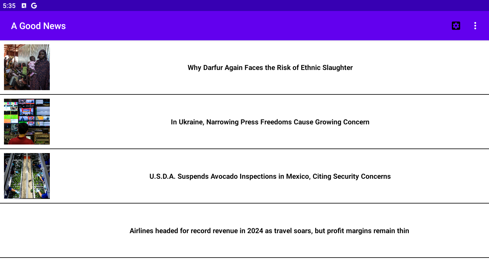
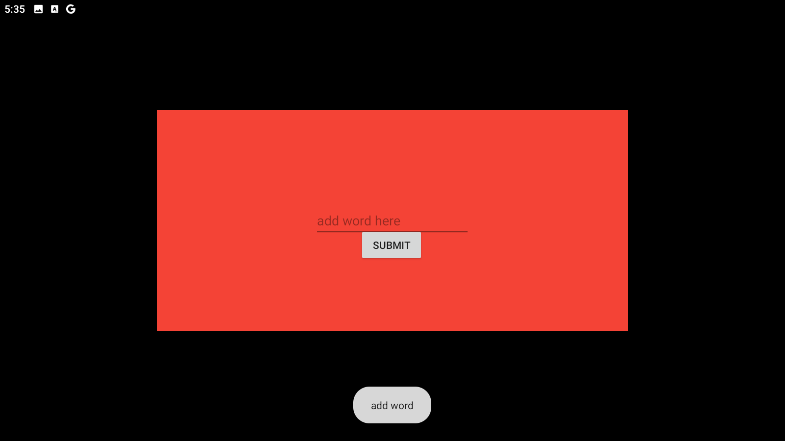
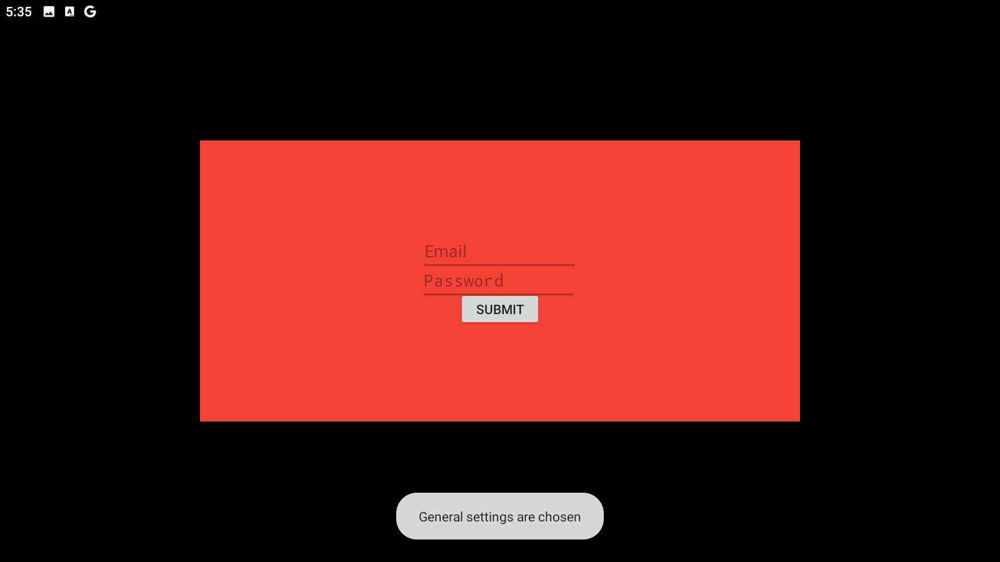

# My Application

My Application is an Android application that fetches and displays news articles from various RSS feeds. It allows users to filter news articles based on positive words and provides a user interface to manage RSS feed links and positive words.

## Features

- Fetch and display news articles from multiple RSS feeds
- Filter news articles based on a predefined list of positive words
- Manage RSS feed links and positive words through a user interface
- Add new positive words via a popup window
- Submit user settings including email address and password to a server

## Screenshots





## Installation

1. Clone the repository:
    ```sh
    git clone https://github.com/eminmuradov10/Android-APP.git
    ```
2. Open the project in Android Studio.
3. Build and run the project on an emulator or physical device.

## Usage

### MainActivity

The `MainActivity` class is the main entry point of the application. It initializes the database, sets up the user interface, and starts the background task to fetch RSS feeds.

### CustomAdapter

The `CustomAdapter` class is used to adapt the list of news articles for display in a ListView. It handles the display of news titles and images, and allows users to click on an item to open the news article in a browser.

### News

The `News` class represents a single news item. It encapsulates the details of a news article including the title, link, publisher, and image URL.

### PopUpWindow

The `PopUpWindow` class is an activity that allows users to input a new positive word. This word is then passed back to the main activity and added to the database.

### RssDatabase

The `RssDatabase` class manages the SQLite database. It provides methods to create tables, add items, remove items, and query items.

### UserSettings

The `UserSettings` class is an activity that allows users to submit their email address and password. It uses the Volley library to send this data to a server.

## Future Changes

### Database Improvements

We plan to make significant improvements to the database part of the code in the future. This includes:

- Optimizing the database schema for better performance
- Implementing more robust error handling and data validation
- Adding support for more complex queries and data relationships

### UI Enhancements

We are also planning to improve the user interface to enhance the user experience. Planned changes include:

- Redesigning the main screen for better usability and aesthetics
- Improving the layout and design of the popup window
- Enhancing the settings screen with a more intuitive layout and additional features
- Adding animations and transitions for a smoother user experience

Stay tuned for updates!

## Contributing

Contributions are welcome! Please open an issue or submit a pull request for any changes.

## License

This project is licensed under the MIT License - see the [LICENSE](LICENSE) file for details.
